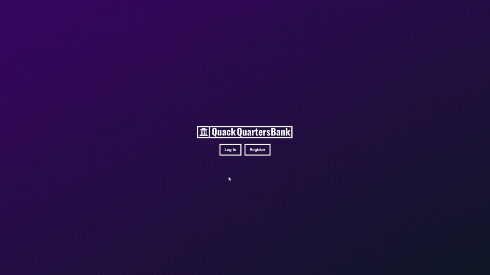
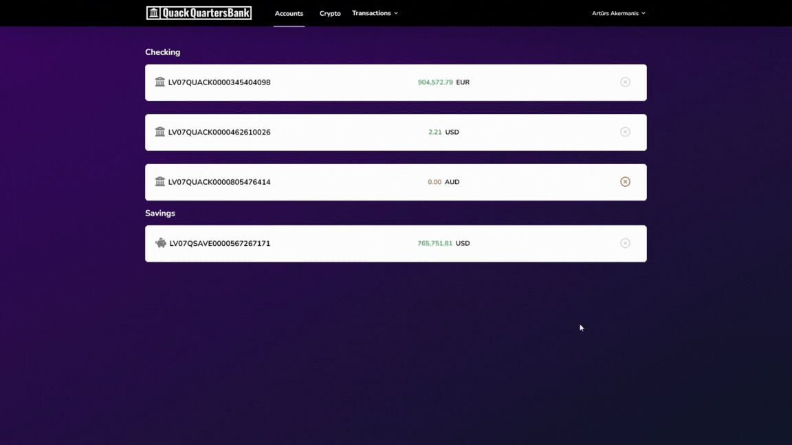

<p align="center"><a href="https://laravel.com" target="_blank"></a></p>

<p align="center">
<a href="https://laravel.com/"></a>
<a href="https://www.mysql.com/"></a>
</p>

## About 

The project is a Laravel-based internet banking application that enables users to register, log in, and perform various banking operations. Users can open both regular and savings accounts, deposit and withdraw money, and transfer funds between accounts. The application also incorporates a two-factor authentication (2FA) system to enhance security. Additionally, the savings account feature allows users to buy and sell cryptocurrencies and view their holdings in a portfolio.

### ⬇️ Preview

🟣 Log in page:
<p align="center"></p>

🟣 Two-factor authentication:
<p align="center"></p>

🟣 Create accounts and delete:
<p align="center"></p>

🟣 Deposit and withdraw money:
<p align="center"></p>

🟣 Transfer money between accounts:
<p align="center"></p>

🟣 Buy cryptocurrencies:
<p align="center"></p>

🟣 View portfolio and sell cryptocurrencies:
<p align="center"></p>

### ⬇️ How to run project locally

1. Clone or download the project
```
git clone https://github.com/Trotsijs/products-page.git
```
2. Run these commands in the project directory to install dependencies
```
composer install
```
and
```
npm install
```
3. Rename `.env.example` to `.env`
4. Get an API key from [CoinMarketCap API](https://coinmarketcap.com/api/)
5. Add the API key to the `.env` file as `CRYPTO_API_KEY=your_api_key`
6. Create a database and add the database credentials to the `.env` file
```
DB_CONNECTION=mysql
DB_HOST=127.0.0.1
DB_PORT=3306
DB_DATABASE=laravel
DB_USERNAME=root
DB_PASSWORD=
```
7. Run this command to migrate the database
```
php artisan migrate
```

9. Start server by running this command
```
php artisan serve
```
10. Run this command to compile assets
```
npm run dev
``` 

11. Go to http://127.0.0.1:8000 in your browser
